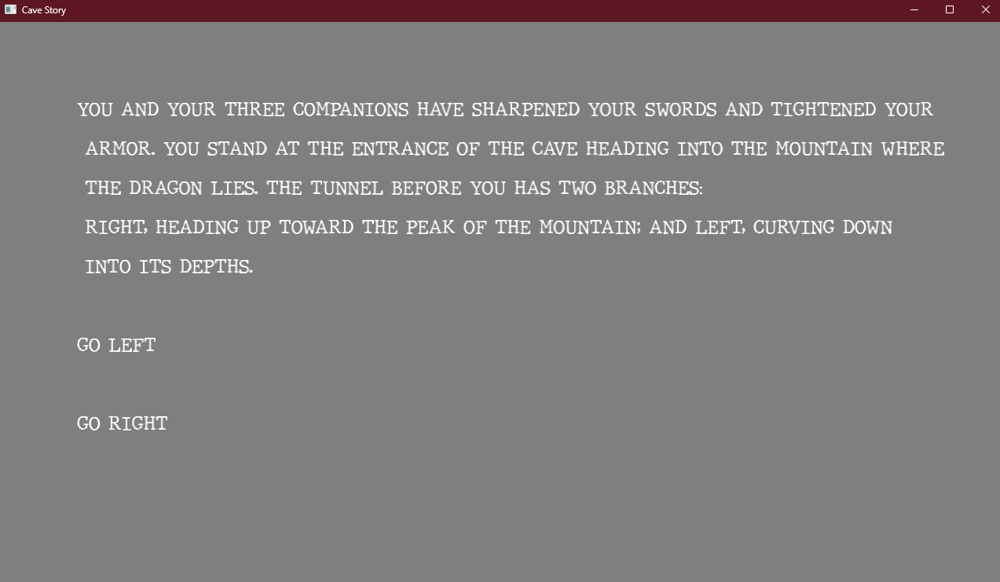

# Cave Story

Author: Thomas Carey (tcarey)

Design: Custom Text Rnderer, branching story.

Text Drawing: Text is entirely rendered at runtime. Random typewriter sounds are added as text is typed out.

Choices: Choices are contained in one large simple data structure that I could easily copy and paste between.

Screen Shot:

How To Play:

W, S, X for options 1, 2, 3 respectively.

Sources: The font: https://www.dafont.com/jmh-typewriter.font

This game was built with [NEST](NEST.md).

